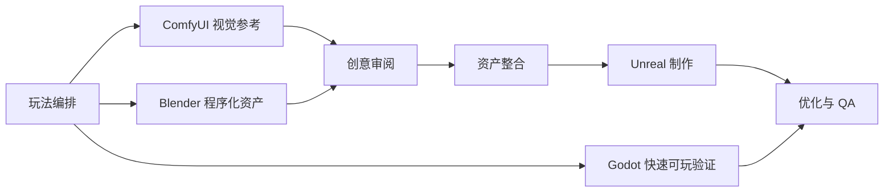

# 灵构工坊

**灵构工坊（Fantasy Agent）是一个 AI 原生的多智能体游戏生产平台。**

灵构工坊不是一键生成游戏的包装器，也不是无代码工具或 vibe coding 演示。它的目标是把玩法想法推进成可以检查、可以执行、可以测试的游戏原型生产工作流，重点服务 game jam 规模的 5 到 15 分钟垂直切片。

`Fantasy Agent` 保留为仓库名、包名、类名、工具名和实现标识；`灵构工坊` 作为面向人的中文项目名。

长期愿景：

> 从想象到可玩的世界。

## 核心定位

- 玩法优先于画面。
- 原型速度优先于生产级完美度。
- 先生成结构化交接，再执行外部工具。
- ComfyUI 与 Blender 输出必须先经过创意审阅，再进入引擎。
- QA 必须先于打包和视觉扩展。
- 所有真实工具操作都必须明确声明并由用户确认。

## 当前能力

灵构工坊当前提供：

- 本地 Studio 桌面式入口，用于从玩法想法生成生产计划。
- 策划工作台，用对话方式挖掘创意，并把点子整理成可执行方案。
- 流程控制台，用于审阅策划交接、记录纠偏、检查 MCP/工具准备度和执行前确认项。
- MCP 连接检测页，用于检查 Fantasy Agent MCP、ComfyUI、Blender、Unreal、Godot 和 GitHub CLI 是否可用。
- Gameplay DSL 与确定性的 Director 工作流。
- 结构化 GDD 生成。
- Blender 程序化资产规划与 Blender Python 脚本生成。
- ComfyUI 视觉参考规划与受控 MCP 工作流准备。
- Creative Review 审阅关卡，用于批准、修改或拒绝生成图片与模型。
- Unreal 项目结构、资产导入、关卡组装、验证和测试计划。
- Godot 快速可玩工程交接，用于轻量验证玩法循环；`--with-gameplay` 已包含 M6b 敌人灰盒压力。
- ChatGPT Apps 兼容的只读工作台工具。
- 面向冒烟测试、可玩性、失败反馈、打包和性能风险的 QA 计划。

## 生产流程



1. **玩法编排**
   将用户想法压缩成一个可玩的核心循环，定义动词、系统、节奏、胜利状态、失败状态和关卡节奏。

2. **ComfyUI 视觉参考**
   根据玩法可读性需求生成角色方向、logo、UI、材质色板和反馈语言的参考图。

3. **Blender 程序化资产**
   生成模块化灰盒资产，例如墙体、门、坡道、危险标记、目标物、出口门和 UI proxy mesh。

4. **创意审阅**
   用户先审阅图片与模型。资产可以被批准、要求修改或拒绝。

5. **资产整合**
   通过明确 manifest 把已批准的 Blender 与 ComfyUI 输出转入引擎导入流程。

6. **Unreal 制作**
   创建工程结构、组装地图、放置资产、串联目标流程，并准备 PIE 或 packaged playtest。

7. **Godot 快速可玩验证**
   为玩法循环计时、路线可读性和交互节奏准备轻量 Godot 工程。

8. **优化与 QA**
   验证可玩性、失败反馈、重开流程、时长、打包准备度和性能风险。

## Studio 界面

本地 Studio 是主要操作界面。

它包含三个核心区域：

- **策划工作台**：负责创意访谈、点子预览、方案确认和生产计划生成。
- **流程控制台**：负责接收策划结果，做执行准备度检查、纠偏记录、任务查看、构建计划查看、视觉计划查看、QA 和 GDD 检查。
- **MCP 端点与连接检测**：显示本地 MCP 地址，并检测所需工具是否可连接。

Windows 快速启动：

```bat
Start-Fantasy-Agent.bat
```

启动后打开：

```text
http://127.0.0.1:7860
```

手动启动：

```powershell
.\.venv\Scripts\python.exe -m uvicorn app.main:app --app-dir apps/studio --host 127.0.0.1 --port 7860
```

安静启动，不显示每次浏览器资源请求日志：

```powershell
.\scripts\start-fantasy-agent.ps1 -App studio
```

调试 HTTP 请求时打开详细访问日志：

```powershell
.\scripts\start-fantasy-agent.ps1 -App studio -VerboseAccessLog
```

如果 `7860` 已被占用，可以换端口：

```powershell
.\.venv\Scripts\python.exe -m uvicorn app.main:app --app-dir apps/studio --host 127.0.0.1 --port 7861
```

## 安全边界

灵构工坊会区分“规划”和“实际执行”。

规划阶段是安全且只读的：

- 生成玩法规格。
- 生成 GDD 文档。
- 准备 Blender、ComfyUI、Unreal、Godot 和 QA 交接。
- 显示任务、风险、实际操作和审阅环节。
- 检查 MCP 端点和本地应用是否可用。

执行阶段会产生实际操作，必须明确确认：

- 启动 Blender 并导出 FBX 或 GLB 资产。
- 提交 ComfyUI prompt 并使用 GPU 资源。
- 写入生成图片、模型、manifest 和日志。
- 启动 Unreal Editor、导入资产、组装地图、运行 PIE 或打包构建。
- 启动 Godot headless import 或写入 Godot 工程文件。
- 创建 Git 分支、提交或推送远端仓库。

ChatGPT Apps 工具默认只读。除非后续实现并确认执行前确认机制，否则不会启动 Unreal、Godot、Blender、ComfyUI、打包或 Git 操作。

## 架构目录

```text
Fantasy-Agent/
|-- apps/
|   |-- studio/                 # 本地桌面式入口
|   |-- web-console/            # 流程控制台
|   |-- chatgpt-workbench/      # ChatGPT Apps MCP 端点与 widget
|   |-- director-agent/         # prompt-to-playable 编排
|   |-- gameplay-agent/         # Gameplay DSL 生成
|   |-- blender-worker/         # Blender 资产计划与 MCP 执行桥
|   |-- comfyui-worker/         # ComfyUI 视觉计划与 MCP 执行桥
|   |-- creative-review-agent/  # 生成结果的用户审阅关卡
|   |-- unreal-builder/         # UE 工程、导入、组装、验证计划
|   |-- godot-builder/          # Godot 快速可玩工程交接
|   `-- qa-agent/               # 可玩性、打包和性能检查
|-- fantasy_agent/              # 共享合约、工作流、MCP 桥接
|-- skills/                     # 智能体行为与流程说明
|-- mcp/                        # MCP 工具合约
|-- templates/                  # 生成模板
|-- generated/                  # 生成计划、资产、manifest 和日志
|-- examples/                   # 示例 prompt 与产物
|-- docs/                       # 架构、流程、DSL 和界面文档
`-- gameplay-schema.yaml        # Gameplay DSL schema
```

## 智能体角色

| 智能体 | 职责 |
| --- | --- |
| Director Agent | 负责完整的 prompt-to-playable 编排。 |
| Gameplay Agent | 生成内聚的玩法循环、系统、节奏和失败状态。 |
| GDD Writer | 生成面向实现的设计文档。 |
| Level Director | 将玩法循环转换为关卡节奏和灰盒需求。 |
| Blender Worker | 准备模块化程序资产任务和 Blender Python 脚本。 |
| ComfyUI Worker | 准备服务玩法可读性的视觉参考流程。 |
| Creative Review Agent | 在生成结果通过审阅前阻止引擎导入。 |
| Unreal Builder | 准备 UE 项目搭建、导入、关卡组装、验证和测试计划。 |
| Godot Builder | 准备 Godot 快速可玩工程交接，用于快速验证玩法循环。 |
| QA Agent | 定义冒烟、可玩性、失败反馈、打包和性能检查。 |

## 核心合约

平台使用 `fantasy_agent/contracts.py` 中的 Pydantic 合约。

关键模型：

- `PromptRequest`：原始玩法想法、时长、引擎、平台、约束和语言。
- `GameplaySpec`：包含循环、系统、进程、关卡节奏、资产需求和工具说明的玩法 DSL。
- `GDDDocument`：Markdown 设计文档。
- `BlenderAssetPlan`：程序化资产任务和导出交接路径。
- `ComfyUIVisualPlan`：带玩法约束的视觉参考任务。
- `CreativeReviewReport`：生成结果的批准、修改和拒绝关卡。
- `UnrealProjectPlan`：UE 目录、插件、地图、蓝图类和自动化步骤。
- `GodotProjectPlan`：Godot 场景、脚本、输入动作和快速可玩导入步骤。
- `QAPlan`：冒烟测试、可玩性检查、打包检查和指标。
- `DirectorBuildPlan`：完整编排输出。

## 策划工作台

灵构工坊在 `apps/chatgpt-workbench` 下提供兼容 ChatGPT Apps 的策划工作台。

生成完整方案后，策划工作台会写入本地策划交接，流程控制台可以载入它，在执行 ComfyUI、Blender、Unreal 或 Godot 实际操作前进行审阅和纠偏。

当前只读工具包括：

- `extract_idea_seed`
- `generate_game_production_plan`
- `decompose_production_tasks`
- `prepare_production_pipeline`
- `render_gdd`
- `prepare_unreal_plan`
- `prepare_godot_plan`
- `prepare_blender_plan`
- `prepare_comfyui_plan`
- `prepare_creative_review_plan`
- `prepare_qa_plan`

如果要在本地 ChatGPT Developer Mode 中测试，可以通过 HTTPS 隧道暴露 Studio，并连接：

```text
https://your-tunnel.example/mcp
```

## 开发

安装：

```powershell
python -m venv .venv
.\.venv\Scripts\Activate.ps1
pip install -e .[dev]
```

运行测试：

```powershell
.\.venv\Scripts\python.exe -m pytest
.\.venv\Scripts\python.exe -m ruff check fantasy_agent tests apps
```

只运行 Director Agent：

```powershell
.\.venv\Scripts\python.exe -m uvicorn app.main:app --app-dir apps/director-agent --host 127.0.0.1 --port 8000
```

API 示例：

```powershell
curl -X POST http://127.0.0.1:8000/plan `
  -H "Content-Type: application/json" `
  -d "{\"prompt\":\"a rooftop parkour demo with wall-runs and checkpoints\",\"target_minutes\":10}"
```

## 当前状态

灵构工坊目前处于早期生产平台阶段：

- 规划合约与确定性工作流已经实现。
- Studio、流程控制台和策划工作台已可使用。
- Blender、ComfyUI、Unreal、Godot 和 QA 交接已经结构化。
- MCP 连接检测页已经能检测所需本地应用。
- Creative Review 审阅关卡已经接入 Director 流水线。
- 真实工具执行仍然受显式执行确认控制。
- M6b 敌人系统已经从 Gameplay DSL 接到 Godot 原型，支持 patrol/chase/stationary/ranged 灰盒敌人。
- M6c 敌人压力指标与调参已经接入执行链和 Studio 生成面板。
- M6d 资产执行面板已经接入 Studio / Flow Console，可独立运行 ComfyUI 与 Blender 资产工人并展示阶段结果。
- M6e approval-gated ingest 已接入 Godot 资产复制，只有 manifest 中 approved 的 Blender GLB 会进入 `assets/generated/`。
- Creative Review 决策已经可以写入 `generated/asset-approval-manifest.yaml`。

下一步优先级：

- 为 approval-gated ingest 增加更细的 QA 覆盖与人工预览。
- 通过受控 MCP 执行确认运行真实 PIE、Godot headless import 和 packaged playtest。
- 为生成图片和模型 manifest 增加更丰富的预览能力。
