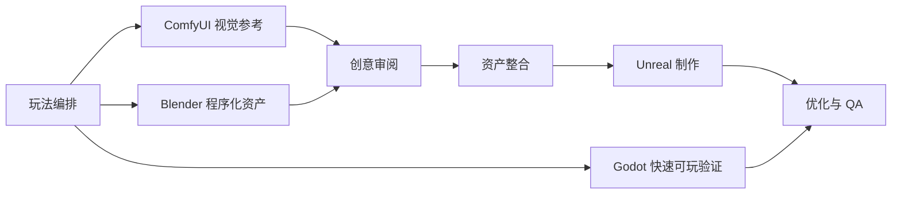

# 灵构工坊

**灵构工坊（Fantasy Agent）是一个 AI 原生的单进程本地游戏生产工作台。**

灵构工坊不是一键生成游戏的包装器，也不是无代码工具或 vibe coding 演示。它的目标是把玩法想法推进成可以检查、可以执行、可以测试的游戏原型生产工作流，重点服务 game jam 规模的 5 到 15 分钟垂直切片。

`Fantasy Agent` 保留为仓库名、包名、类名、工具名和实现标识；`灵构工坊` 作为面向人的中文项目名。

灵构工坊是一个**独立工作台**：单个 Python 进程、一个本地端口、一套共享库。它不连接外部 Agent，也不对外暴露任何 MCP 端点供其他客户端接入。所有生产角色（Director、Gameplay、GDD、Blender、ComfyUI、Unreal、Godot、QA）都以 `fantasy_agent/` 下的库内模块形式存在，由 Studio 进程直接调用，没有进程间 RPC。本地工具（Blender / ComfyUI / Unreal / Godot / GitHub CLI）仍会被探测与执行，但它们是你自己机器上的工具，不是外部 Agent 服务。

长期愿景：

> 从想象到可玩的世界。

## 核心定位

- 玩法优先于画面。
- 原型速度优先于生产级完美度。
- 先生成结构化交接，再执行外部工具。
- ComfyUI 与 Blender 输出必须先经过创意审阅，再进入引擎。
- QA 必须先于打包和视觉扩展。
- 所有真实工具操作都必须明确声明并由用户确认。

## 当前能力

灵构工坊当前提供：

- 本地 Studio 桌面式入口，用于从玩法想法生成生产计划。
- 策划工作台，用对话方式挖掘创意，并把点子整理成可执行方案。
- 流程控制台，用于审阅策划交接、记录纠偏、检查本地工具准备度和执行前确认项。
- 工具环境检测页，用于检查 ComfyUI、Blender、Unreal、Godot 和 GitHub CLI 在本机是否可用。
- Gameplay DSL 与确定性的 Director 工作流。
- 结构化 GDD 生成。
- Blender 程序化资产规划与 Blender Python 脚本生成。
- ComfyUI 视觉参考规划与受控本地工作流准备。
- Creative Review 审阅关卡，用于批准、修改或拒绝生成图片与模型。
- Unreal 项目结构、资产导入、关卡组装、验证和测试计划。
- Godot 快速可玩工程交接，用于轻量验证玩法循环；`--with-gameplay` 已包含 M6b 敌人灰盒压力。
- 本地 REST 规划工具 API（`/api/tools/{tool_name}`），供工作台页面调用。
- 面向冒烟测试、可玩性、失败反馈、打包和性能风险的 QA 计划。

## 生产流程



1. **玩法编排**
   将用户想法压缩成一个可玩的核心循环，定义动词、系统、节奏、胜利状态、失败状态和关卡节奏。

2. **ComfyUI 视觉参考**
   根据玩法可读性需求生成角色方向、logo、UI、材质色板和反馈语言的参考图。

3. **Blender 程序化资产**
   生成模块化灰盒资产，例如墙体、门、坡道、危险标记、目标物、出口门和 UI proxy mesh。

4. **创意审阅**
   用户先审阅图片与模型。资产可以被批准、要求修改或拒绝。

5. **资产整合**
   通过明确 manifest 把已批准的 Blender 与 ComfyUI 输出转入引擎导入流程。

6. **Unreal 制作**
   创建工程结构、组装地图、放置资产、串联目标流程，并准备 PIE 或 packaged playtest。

7. **Godot 快速可玩验证**
   为玩法循环计时、路线可读性和交互节奏准备轻量 Godot 工程。

8. **优化与 QA**
   验证可玩性、失败反馈、重开流程、时长、打包准备度和性能风险。

## Studio 界面

本地 Studio 是主要操作界面。

它包含四个核心区域：

- **策划工作台**：负责创意访谈、点子预览、方案确认和生产计划生成。
- **流程控制台**：负责接收策划结果，做执行准备度检查、纠偏记录、任务查看、构建计划查看、视觉计划查看、QA 和 GDD 检查。
- **工具环境检测**：检测 Blender、ComfyUI、Unreal、Godot 和 GitHub CLI 在本机是否可用，并给出下一步动作。
- **API 接入**：配置可选的大模型 API，让玩法与 GDD 生成从确定性模板升级为模型生成。

Windows 快速启动（推荐，桌面窗口）：

```bat
Start-Fantasy-Agent.bat
```

双击后会做三件事：准备 Python 环境、启动后端、在**原生窗口**里打开界面。不需要终端，
也不会拉起浏览器。

**关闭窗口不会退出应用**，而是收进系统托盘——后端继续跑，下次打开是即时的，不用再等
健康检查。要真正退出，用托盘菜单里的「退出」。这是托盘的常规行为，对这个工具尤其划算：
后端启动最慢要几十秒，每次关窗口都重建一遍纯属浪费。

托盘需要 `pystray` 和 `Pillow`（都在 `[desktop]` 依赖组里）。如果托盘起不来（比如没有
通知区域的会话），窗口仍然正常打开，只是关掉即退出——托盘失败不会拖垮窗口。

调试时想看控制台输出，传 `--console`：

```bat
Start-Fantasy-Agent.bat --console
```

不想用托盘（关窗口即退出），传 `--no-tray`（bat 会把它转发给桌面启动器；`--console`
要放在第一个参数的位置）：

```bat
Start-Fantasy-Agent.bat --no-tray
```

桌面启动器的其它用法：

```powershell
# 打印将要使用的端口与地址，不启动任何东西
.\.venv\Scripts\python.exe apps/studio/desktop.py --print-plan

# 只验证后端能起来（起进程 → 查 /health → 停进程），不开窗口
.\.venv\Scripts\python.exe apps/studio/desktop.py --smoke-test

# 换端口
.\.venv\Scripts\python.exe apps/studio/desktop.py --port 7900

# 关闭窗口即退出，不驻留托盘
.\.venv\Scripts\python.exe apps/studio/desktop.py --no-tray
```

桌面窗口依赖 `pywebview`、`pystray` 和 `Pillow`，它们不在核心依赖里。首次使用装一次：

```powershell
.\.venv\Scripts\python.exe -m pip install -e .[desktop]
```

浏览器启动方式（原有方式，仍然可用）：

```powershell
.\scripts\start-fantasy-agent.ps1
```

启动后打开 `http://127.0.0.1:7860`。

只做启动冒烟测试，测完即停：

```powershell
.\scripts\start-fantasy-agent.ps1 -SmokeTest -NoOpen
```

前端界面：两条启动路径都会在 `apps/frontend/dist/index.html` 缺失时自动构建 React 界面
（只在缺失时跑一次）。加 `-SkipBuild`（PS 脚本）或 `--skip-build`（桌面启动器）可跳过构建，
但此时界面路由会返回 503。手动构建用 `npx vite build`。

如果 `7860` 已被占用，两条路径都会自动向上找空闲端口；也可以手动指定：

```powershell
.\.venv\Scripts\python.exe -m uvicorn app.main:app --app-dir apps/studio --host 127.0.0.1 --port 7861
```

## 安全边界

灵构工坊会区分“规划”和“实际执行”。

规划阶段是安全且只读的：

- 生成玩法规格。
- 生成 GDD 文档。
- 准备 Blender、ComfyUI、Unreal、Godot 和 QA 交接。
- 显示任务、风险、实际操作和审阅环节。
- 检查本地工具应用是否可用。

执行阶段会产生实际操作，必须明确确认：

- 启动 Blender 并导出 FBX 或 GLB 资产。
- 提交 ComfyUI prompt 并使用 GPU 资源。
- 写入生成图片、模型、manifest 和日志。
- 启动 Unreal Editor、导入资产、组装地图、运行 PIE 或打包构建。
- 启动 Godot headless import 或写入 Godot 工程文件。
- 创建 Git 分支、提交或推送远端仓库。

本地工作台工具默认只读。除非显式确认执行，否则不会启动 Blender、ComfyUI、Unreal、Godot、打包或 Git 操作。

工作台不对外暴露 MCP 端点：外部客户端无法连入，所有能力只能通过本机 `127.0.0.1` 的 Studio 界面或 CLI 使用。

## API 接入

灵构工坊默认**完全确定性**运行，不联网、不需要任何密钥。API 接入面板是可选的增强项：配置后，玩法设计与 GDD 生成会改为调用大模型；不配置或调用失败时，自动回退到确定性生成，流程绝不中断。

在 Studio 的 **API 接入**面板中可以配置：

| 字段 | 说明 |
| --- | --- |
| 启用 | 打开后，生成流程才会尝试调用模型。关闭即为纯确定性模式。 |
| Provider | `anthropic`（Claude Messages API）或 `openai_compatible`（任意 OpenAI 兼容网关，含本地模型）。 |
| Base URL | 留空用官方默认地址；填网关地址时会自动补全 `/v1/messages` 或 `/chat/completions`。 |
| Model | 留空用 provider 默认模型。 |
| API key | 保存后不再回显，界面只显示掩码。留空提交表示沿用已保存的密钥。 |
| Timeout | 单次请求超时秒数，5–600 秒。 |

点 **Test connection** 会用一句话的最小请求真实探测一次，返回延迟、HTTP 状态码与失败原因（缺密钥 / HTTP 错误 / 不可达 / 响应非 JSON）。**Clear credentials** 会清空并删除本地配置文件。

几个实现事实：

- **不需要安装任何 SDK**。两个 provider 都用标准库直接发 HTTP，所以填完就能用，不必执行 `pip install fantasy-agent[llm]`。
- **配置只存本机**，路径为 `generated/config/llm-api.json`，文件权限设为仅当前用户可读写。密钥不会写进日志，也不会随响应返回给浏览器（只返回掩码）。
- **环境变量仍然生效**：`ANTHROPIC_API_KEY`、`OPENAI_API_KEY`、`FANTASY_AGENT_MODEL`、`FANTASY_AGENT_BASE_URL`、`FANTASY_AGENT_USE_LLM` 的优先级低于界面保存的配置，未配置界面时作为兜底。
- **失败即降级**：任何模型调用失败（未配置、超时、限流、返回非法 JSON、输出不通过 `GameplaySpec` 校验）都会回退到确定性生成，并在产物中记录风险。

## 架构目录

```text
Fantasy-Agent/
|-- apps/
|   |-- studio/                 # 唯一的独立工作台进程（Web 入口 + 全部 REST 规划 API）
|   |   |-- app/main.py         # FastAPI 应用
|   |   `-- desktop.py          # 桌面窗口入口（托管后端 + 原生 WebView）
|   `-- frontend/               # 唯一的界面源码（Vite + React/TSX）；dist 缺失时界面路由 503，不再回退旧页
|-- fantasy_agent/              # 共享合约、库内生产角色、工作流、本地工具桥接
|-- skills/                     # 角色行为与流程说明
|-- mcp/                        # 本地工具（Blender/ComfyUI/Unreal/Godot/GitHub）合约
|-- templates/                  # 生成模板
|-- generated/                  # 生成计划、资产、manifest 和日志
|-- examples/                   # 示例 prompt 与产物
|-- docs/                       # 架构、流程、DSL 和界面文档
|-- scripts/                    # 启动脚本
`-- gameplay-schema.yaml        # Gameplay DSL schema
```

## 生产角色（库内模块，非独立服务）

以下角色全部是 `fantasy_agent/` 下的 Python 模块，由 Studio 进程直接调用。它们**不是**独立进程，彼此之间没有 RPC。

| 角色 | 职责 | 主要模块 |
| --- | --- | --- |
| Director | 负责完整的 prompt-to-playable 编排。 | `workflows.py`、`executor.py` |
| Gameplay Designer | 生成内聚的玩法循环、系统、节奏和失败状态。 | `generation.py` |
| GDD Writer | 生成面向实现的设计文档。 | `gdd.py` |
| Level Director | 将玩法循环转换为关卡节奏和灰盒需求。 | `generation.py`、`production_specs.py` |
| Blender Worker | 准备模块化程序资产任务和 Blender Python 脚本。 | `blender_codegen.py`、`blender_procedural_job.py` |
| ComfyUI Worker | 准备服务玩法可读性的视觉参考流程。 | `comfyui_mcp.py` |
| Creative Reviewer | 在生成结果通过审阅前阻止引擎导入。 | `workflows.py`、`approval_manifest.py` |
| Unreal Builder | 准备 UE 项目搭建、导入、关卡组装、验证和测试计划。 | `unreal_mcp.py` |
| Godot Builder | 准备 Godot 快速可玩工程交接，用于快速验证玩法循环。 | `godot_mcp.py` |
| QA | 定义冒烟、可玩性、失败反馈、打包和性能检查。 | `workflows.py` |

## 核心合约

平台使用 `fantasy_agent/contracts.py` 中的 Pydantic 合约。

关键模型：

- `PromptRequest`：原始玩法想法、时长、引擎、平台、约束和语言。
- `GameplaySpec`：包含循环、系统、进程、关卡节奏、资产需求和工具说明的玩法 DSL。
- `GDDDocument`：Markdown 设计文档。
- `BlenderAssetPlan`：程序化资产任务和导出交接路径。
- `ComfyUIVisualPlan`：带玩法约束的视觉参考任务。
- `CreativeReviewReport`：生成结果的批准、修改和拒绝关卡。
- `UnrealProjectPlan`：UE 目录、插件、地图、蓝图类和自动化步骤。
- `GodotProjectPlan`：Godot 场景、脚本、输入动作和快速可玩导入步骤。
- `QAPlan`：冒烟测试、可玩性检查、打包检查和指标。
- `DirectorBuildPlan`：完整编排输出。

## 策划工作台

策划工作台页面由 Studio 直接提供，打开 `http://127.0.0.1:7860/workbench` 即可使用，不需要任何外部客户端。

生成完整方案后，策划工作台会写入本地策划交接，流程控制台可以载入它，在执行 ComfyUI、Blender、Unreal 或 Godot 实际操作前进行审阅和纠偏。

当前只读工具（通过 `POST /api/tools/{tool_name}` 调用）包括：

- `extract_idea_seed`
- `generate_game_production_plan`
- `decompose_production_tasks`
- `prepare_production_pipeline`
- `render_gdd`
- `prepare_unreal_plan`
- `prepare_godot_plan`
- `prepare_blender_plan`
- `prepare_comfyui_plan`
- `prepare_creative_review_plan`
- `prepare_qa_plan`

所有工具端点都只监听 `127.0.0.1`，不接受外部客户端接入。

## 开发

安装：

```powershell
python -m venv .venv
.\.venv\Scripts\Activate.ps1
pip install -e .[dev]
```

需要桌面窗口时额外装一次 `.[desktop]`（见上方「Windows 快速启动」）。

运行测试：

```powershell
.\.venv\Scripts\python.exe scripts/run_tests.py
.\.venv\Scripts\python.exe -m ruff check fantasy_agent tests apps
```

测试必须走 `scripts/run_tests.py`，**不要**直接 `python -m pytest`。原因见 `AGENTS.md`
的「测试与校验」一节：pytest 默认的临时目录回收方式会在本机触发护栏，导致退出码失真——
测试可能是通过的，却报不出来。脚本接受 pytest 参数，例如
`scripts/run_tests.py -k desktop -v`。

Studio 是唯一入口，没有需要单独启动的 Agent 服务。

## 打包

```powershell
.\.venv\Scripts\python.exe scripts/package_desktop.py --target windows --zip
```

产物写到 `dist/`（已 gitignore）：Windows 出安装包，macOS 出 `.app` / `.dmg`，
Linux 出 `.deb` / `.AppImage`。目录包自带 `runtime/`——构建时从当前解释器拷入的
Python 与依赖，启动器指向它，不依赖目标机器装没装 Python。

**脚本只能构建当前平台的产物，跨平台会被明确拒绝。** PyInstaller 不支持交叉编译，
`.dmg` 需要 macOS 的 `hdiutil`，`.deb` 需要 `dpkg-deb`——在 Windows 上"成功"构建出来的
macOS 包，在 macOS 上起不来。所以三个平台各自在原生 runner 上跑，由
`.github/workflows/release.yml` 的矩阵负责；打 tag（`v*`）触发，产物进**草稿** release，
由人决定要不要发。

应用图标不是提交进仓库的二进制文件，而是由 `apps/studio/icons.py` 用代码画出来的
（托盘图标、窗口图标、安装包图标共用同一份绘制，改一处三处一起变）。

**这些产物目前都没有代码签名**，也没有 macOS 公证。首次运行会触发 SmartScreen /
Gatekeeper 警告，这是预期行为。在接入证书之前，不要把任何一次发布描述为"已签名"或
"已公证"——`tests/test_packaging.py` 会把这类措辞当成缺陷。

安装工具链缺失时脚本会**跳过**该步骤并打印出来（例如本机没有 Inno Setup 就不产 `.exe`），
不会静默降级成一个残缺的包；目录形态的 bundle 始终会产出，那是被测试过的那个形态。

REST 规划 API 示例：

```powershell
curl -X POST http://127.0.0.1:7860/api/plan `
  -H "Content-Type: application/json" `
  -d "{\"prompt\":\"a rooftop parkour demo with wall-runs and checkpoints\",\"target_minutes\":10}"
```

策划工作台工具端点示例：

```powershell
curl -X POST http://127.0.0.1:7860/api/tools/prepare_godot_plan `
  -H "Content-Type: application/json" `
  -d "{\"prompt\":\"a rooftop parkour demo with wall-runs and checkpoints\",\"target_minutes\":10}"
```

命令行（无 Web 界面）：

```powershell
python -m fantasy_agent --prompt "a rooftop parkour demo with wall-runs and checkpoints" --minutes 10
```

## 当前状态

灵构工坊目前处于早期生产平台阶段：

- 规划合约与确定性工作流已经实现。
- Studio、流程控制台和策划工作台已可使用。
- 所有生产角色已收敛为 `fantasy_agent/` 下的库内模块，由 Studio 单进程直接调用。
- 对外 MCP 端点与 ChatGPT Apps 入口已移除，工作台完全本地自闭环。
- Blender、ComfyUI、Unreal、Godot 和 QA 交接已经结构化。
- 工具环境检测页已经能检测所需本地应用。
- Creative Review 审阅关卡已经接入 Director 流水线。
- 真实工具执行仍然受显式执行确认控制。
- M6b 敌人系统已经从 Gameplay DSL 接到 Godot 原型，支持 patrol/chase/stationary/ranged 灰盒敌人。
- M6c 敌人压力指标与调参已经接入执行链和 Studio 生成面板。
- M6d 资产执行面板已经接入 Studio / Flow Console，可独立运行 ComfyUI 与 Blender 资产工人并展示阶段结果。
- M6e approval-gated ingest 已接入 Godot 资产复制，只有 manifest 中 approved 的 Blender GLB 会进入 `assets/generated/`。
- M6f approval gate QA 与预览闭环已接入：执行阶段会写出 `approval-gate-report.yaml`，Studio 会显示 approved / skipped / revision / rejected / pending 摘要。
- Creative Review 决策已经可以写入 `generated/asset-approval-manifest.yaml`。
- M7.1-M7.5 已完成第一轮：Bundle 加载/阻断、Godot Spec 驱动、配置编译、Studio 追踪和 Unreal adapter/QA 已贯通。

下一步优先级：

- 在真实 Unreal Editor 中导入 M7 DataTable/DataAsset adapter 源并运行 PIE/DataValidation。
- 增加 Godot packaged playtest 与运行时指标采集，让机器 QA 使用真实 playtest 数据。
- 为 schema version 增加 migration、bundle diff 和变更审批能力。

## M7 Agent 可执行生产 Spec

M7 将 `GameplaySpec` 提升为可加载、可校验、可编译、可追踪、可阻断的 `ProductionSpecBundle` 权威输入：

- **M7.1**：支持 YAML/JSON bundle loader、跨 Spec 深度校验、`--spec-file` 和执行前阻断。
- **M7.2**：Godot 的路线、战斗、数值、HUD 与失败反馈优先由 `CombatSpec`、`LevelSpec`、`NumericTuningSpec`、`NarrativeSpec` 驱动；旧 `GameplaySpec` 仅保留兼容回退。
- **M7.3**：`ConfigTableCompiler` 可确定性输出 YAML、JSON、CSV-ready 配置；Creative Review manifest 会同步 `ResourcePipelineSpec` 的 approval 状态。
- **M7.4**：Flow Console 提供 Spec Bundle 面板，展示深度校验、编译产物、字段到产物追踪和机器 QA。
- **M7.5**：Unreal adapter 会生成 `DT_Enemies.json`、`DT_Encounters.json`、`DA_ProductionSpec.json`、`SpecTrace.json` 和 `QA_Executable.json`，再进入 DataValidation。

CLI 示例：

```powershell
python -m fantasy_agent --spec-file generated/specs/production-spec-bundle.yaml --format specs
python -m fantasy_agent --spec-file generated/specs/production-spec-bundle.yaml --engine "Godot 4" --execute --yes --with-gameplay
python -m fantasy_agent --spec-file generated/specs/production-spec-bundle.yaml --engine "UE5" --execute --yes --no-import
```

任何深度校验错误都会在工程写盘前产生 `spec_validation: failed`，不会继续创建 Godot 或 Unreal 工程。