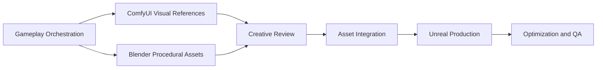

# Fantasy Agent

**An AI-native multi-agent game production platform.**

**Fantasy Agent 是一个 AI 原生的多智能体游戏生产平台。**

Fantasy Agent turns gameplay ideas into playable Unreal Engine prototype workflows through agent orchestration, structured design output, procedural asset generation, MCP-integrated tooling, and human review gates.

Fantasy Agent 通过智能体编排、结构化设计输出、程序化资产生成、MCP 工具集成和人工审阅关卡，把玩法想法推进到可运行的 Unreal Engine 原型工作流。

This is not a one-click game generator, a no-code wrapper, or a vibe-coding demo. It is a gameplay-first production workbench for short, testable, game-jam-scale vertical slices.

这不是一键游戏生成器、无代码包装器，也不是 vibe coding 项目。它的目标是成为一个玩法优先的生产工作台，用于快速制作短小、可测试、game jam 规模的垂直切片。

## Core Idea / 核心定位

- Gameplay before graphics.
- Prototype speed before production perfection.
- Structured handoffs before tool execution.
- Human review before asset ingestion.
- QA before packaging and visual expansion.

- 玩法优先于画面。
- 原型速度优先于生产级完美度。
- 先生成结构化交接，再执行工具。
- 资产进入 Unreal 前必须经过人工审阅。
- QA 先于打包和视觉扩展。

Long-term vision:

长期愿景：

> From imagination to playable worlds.

> 从想象到可玩的世界。

## What Fantasy Agent Does / 当前能力

Fantasy Agent currently provides:

Fantasy Agent 当前提供：

- A local Studio interface for prompt-to-playable planning.
- 一个本地 Studio 界面，用于从玩法想法生成生产计划。
- A gameplay DSL and deterministic Director workflow.
- Gameplay DSL 与确定性的 Director 工作流。
- Structured GDD generation in English and Simplified Chinese.
- 中英双语结构化 GDD 生成。
- Blender procedural asset planning and Blender Python script generation.
- Blender 程序化资产规划与 Blender Python 脚本生成。
- ComfyUI visual reference planning and MCP workflow preparation.
- ComfyUI 视觉参考规划与 MCP 工作流准备。
- Creative Review gates for approving, revising, or rejecting generated images and meshes.
- Creative Review 审阅关卡，用于批准、修改或拒绝生成图片与模型。
- Unreal project, asset ingest, level assembly, validation, and playtest planning.
- Unreal 项目、资产导入、关卡组装、验证和测试计划。
- ChatGPT Apps-compatible read-only workbench tools.
- ChatGPT Apps 兼容的只读工作台工具。
- QA plans for smoke testing, playability, failure feedback, packaging, and performance checks.
- 面向冒烟测试、可玩性、失败反馈、打包和性能检查的 QA 计划。

## Production Flow / 生产流程



1. **Gameplay orchestration / 玩法编排**
   Convert a prompt into a coherent loop, verbs, systems, pacing, win state, failure states, and level beats.

2. **ComfyUI visual references / ComfyUI 视觉参考**
   Generate readable references for character direction, logo, UI, material palette, and feedback language.

3. **Blender procedural assets / Blender 程序化资产**
   Generate modular greybox meshes such as walls, doors, ramps, hazards, objectives, exit gates, and UI proxy meshes.

4. **Creative Review / 创意审阅**
   Review generated images and meshes with the user before Unreal ingest. Assets can be approved, revised, or rejected.

5. **Asset integration / 资产整合**
   Move approved Blender and ComfyUI outputs into Unreal through explicit manifests.

6. **Unreal production / UE 制作**
   Create project structure, assemble maps, place assets, wire objective flow, and prepare PIE or packaged playtests.

7. **Optimization and QA / 优化与测试**
   Validate playability, failure feedback, restart flow, session length, packaging readiness, and performance risk.

## Studio Interface / Studio 界面

The local Studio is the main operator surface.

本地 Studio 是主要操作界面。

It includes:

它包含：

- Planning Workbench: ChatGPT Apps-compatible planning tools for gameplay intake, plan generation, and structured handoff.
- 策划工作台：兼容 ChatGPT Apps 的规划工具，负责玩法输入、方案生成和结构化交接。
- Flow Console: execution-readiness dashboard for planning handoff review, correction notes, side-effect gates, tasks, build plans, visuals, QA, GDD, and DSL.
- 流程控制台：面向执行准备度的控制台，负责策划交接审阅、纠偏记录、副作用门禁、任务、构建计划、视觉、QA、GDD 和 DSL。
- MCP endpoint panel: local endpoint information for future ChatGPT and tool integrations.
- MCP 端点面板：用于后续 ChatGPT 与工具集成的本地端点信息。

Start it on Windows:

Windows 启动方式：

```bat
Start-Fantasy-Agent.bat
```

Then open:

然后打开：

```text
http://127.0.0.1:7860
```

Manual start:

手动启动：

```powershell
.\.venv\Scripts\python.exe -m uvicorn app.main:app --app-dir apps/studio --host 127.0.0.1 --port 7860
```

Quiet launch without per-request access logs:

安静启动，不显示每次浏览器资源请求日志：

```powershell
.\scripts\start-fantasy-agent.ps1 -App studio
```

Verbose HTTP access logs for debugging:

调试 HTTP 请求时打开详细访问日志：

```powershell
.\scripts\start-fantasy-agent.ps1 -App studio -VerboseAccessLog
```

If port `7860` is already in use, choose another port:

如果 `7860` 已被占用，可以换端口：

```powershell
.\.venv\Scripts\python.exe -m uvicorn app.main:app --app-dir apps/studio --host 127.0.0.1 --port 7861
```

## Safety Boundary / 安全边界

Fantasy Agent separates planning from execution.

Fantasy Agent 会区分“规划”和“实际执行”。

Planning is safe and read-only:

规划阶段是安全且只读的：

- Generate gameplay specs.
- 生成玩法规格。
- Render GDD documents.
- 生成 GDD 文档。
- Prepare Blender, ComfyUI, Unreal, and QA handoffs.
- 准备 Blender、ComfyUI、Unreal 和 QA 交接。
- Show tasks, risks, side effects, and review gates.
- 显示任务、风险、副作用和审阅关卡。

Execution creates side effects and must be explicitly confirmed:

执行阶段会产生副作用，必须明确确认：

- Launching Blender and exporting FBX or GLB assets.
- 启动 Blender 并导出 FBX 或 GLB 资产。
- Submitting ComfyUI prompts and using GPU resources.
- 提交 ComfyUI prompt 并使用 GPU 资源。
- Writing generated images, meshes, manifests, and logs.
- 写入生成图片、模型、manifest 和日志。
- Launching Unreal Editor, importing assets, assembling maps, running PIE, or packaging builds.
- 启动 Unreal Editor、导入资产、组装地图、运行 PIE 或打包构建。

ChatGPT Apps tools are read-only by default. They do not launch Unreal, Blender, ComfyUI, packaging, or Git actions unless explicit side-effect gates are implemented and confirmed.

ChatGPT Apps 工具默认只读。除非后续实现并确认副作用关卡，否则不会启动 Unreal、Blender、ComfyUI、打包或 Git 操作。

## Architecture / 架构

```text
Fantasy-Agent/
|-- apps/
|   |-- studio/                 # Local desktop-style shell
|   |-- web-console/            # Flow Console UI
|   |-- chatgpt-workbench/      # ChatGPT Apps MCP endpoint and widget
|   |-- director-agent/         # Prompt-to-playable orchestration
|   |-- gameplay-agent/         # Gameplay DSL generation
|   |-- blender-worker/         # Blender asset plans and MCP execution bridge
|   |-- comfyui-worker/         # ComfyUI visual plans and MCP execution bridge
|   |-- creative-review-agent/  # User review gates for generated outputs
|   |-- unreal-builder/         # UE project, ingest, assembly, validation plans
|   `-- qa-agent/               # Playability, packaging, and performance checks
|-- fantasy_agent/              # Shared contracts, workflows, MCP bridges
|-- skills/                     # Agent behavior and workflow guidance
|-- mcp/                        # MCP tool contracts
|-- templates/                  # ComfyUI and generation templates
|-- generated/                  # Generated plans, assets, manifests, and logs
|-- examples/                   # Example prompts and artifacts
|-- docs/                       # Architecture, workflow, DSL, and research notes
|-- legacy/                     # Preserved legacy code
`-- gameplay-schema.yaml        # Gameplay DSL schema
```

## Agent Roles / 智能体角色

| Agent | Responsibility | 职责 |
| --- | --- | --- |
| Director Agent | Owns the full prompt-to-playable workflow. | 负责完整的 prompt-to-playable 编排。 |
| Gameplay Agent | Creates coherent gameplay loops, systems, pacing, and failure states. | 生成内聚的玩法循环、系统、节奏和失败状态。 |
| GDD Writer | Renders implementation-facing design documents. | 生成面向实现的设计文档。 |
| Level Director | Converts loops into level beats and greybox needs. | 将玩法循环转换为关卡节奏和灰盒需求。 |
| Blender Worker | Prepares modular procedural asset jobs and Blender Python scripts. | 准备模块化程序资产任务和 Blender Python 脚本。 |
| ComfyUI Worker | Prepares gameplay-readable visual reference workflows. | 准备服务玩法可读性的视觉参考流程。 |
| Creative Review Agent | Blocks Unreal ingest until generated outputs are reviewed. | 在生成结果通过审阅前阻止 Unreal 导入。 |
| Unreal Builder | Prepares UE project setup, ingest, level assembly, validation, and playtest plans. | 准备 UE 项目搭建、导入、关卡组装、验证和测试计划。 |
| QA Agent | Defines smoke, playability, failure feedback, packaging, and performance checks. | 定义冒烟、可玩性、失败反馈、打包和性能检查。 |

## Core Contracts / 核心合约

The platform uses Pydantic contracts in `fantasy_agent/contracts.py`.

平台使用 `fantasy_agent/contracts.py` 中的 Pydantic 合约。

Important models:

关键模型：

- `PromptRequest`: source prompt, session length, engine, platforms, constraints, and locales.
- `PromptRequest`：原始玩法想法、时长、引擎、平台、约束和语言。
- `GameplaySpec`: gameplay DSL with loop, systems, progression, beats, asset needs, and tool notes.
- `GameplaySpec`：包含循环、系统、进程、关卡节奏、资产需求和工具说明的玩法 DSL。
- `GDDDocument`: markdown design document with bilingual output.
- `GDDDocument`：中英双语 Markdown 设计文档。
- `BlenderAssetPlan`: procedural asset jobs and export handoff paths.
- `BlenderAssetPlan`：程序化资产任务和导出交接路径。
- `ComfyUIVisualPlan`: visual reference jobs with gameplay constraints.
- `ComfyUIVisualPlan`：带玩法约束的视觉参考任务。
- `CreativeReviewReport`: approval, revision, and rejection gate for generated outputs.
- `CreativeReviewReport`：生成结果的批准、修改和拒绝关卡。
- `UnrealProjectPlan`: UE folders, plugins, maps, Blueprint classes, and automation steps.
- `UnrealProjectPlan`：UE 目录、插件、地图、蓝图类和自动化步骤。
- `QAPlan`: smoke tests, playability checks, packaging checks, and metrics.
- `QAPlan`：冒烟测试、可玩性检查、打包检查和指标。
- `DirectorBuildPlan`: combined orchestration output.
- `DirectorBuildPlan`：完整编排输出。

## Planning Workbench / 策划工作台

Fantasy Agent includes a ChatGPT Apps-compatible planning workbench under `apps/chatgpt-workbench`.

Fantasy Agent 在 `apps/chatgpt-workbench` 下提供兼容 ChatGPT Apps 的策划工作台。

When a full plan is generated, the Planning Workbench writes a local planning handoff that the Flow Console can load for review and correction before any ComfyUI, Blender, or Unreal side effects are run.

生成完整方案后，策划工作台会写入本地策划交接，流程控制台可以载入它，在执行 ComfyUI、Blender 或 Unreal 副作用前进行审阅和纠偏。

Available read-only tools include:

当前只读工具包括：

- `generate_game_production_plan`
- `decompose_production_tasks`
- `prepare_production_pipeline`
- `render_gdd`
- `prepare_unreal_plan`
- `prepare_blender_plan`
- `prepare_comfyui_plan`
- `prepare_creative_review_plan`
- `prepare_qa_plan`

For local ChatGPT Developer Mode testing, expose the Studio through an HTTPS tunnel and connect to:

如果要在本地 ChatGPT Developer Mode 中测试，可以通过 HTTPS 隧道暴露 Studio，并连接：

```text
https://your-tunnel.example/mcp
```

## Development / 开发

Install:

安装：

```powershell
python -m venv .venv
.\.venv\Scripts\Activate.ps1
pip install -e .[dev]
```

Run tests:

运行测试：

```powershell
.\.venv\Scripts\python.exe -m pytest
.\.venv\Scripts\python.exe -m ruff check fantasy_agent tests apps
```

Run the Director Agent only:

只运行 Director Agent：

```powershell
.\.venv\Scripts\python.exe -m uvicorn app.main:app --app-dir apps/director-agent --host 127.0.0.1 --port 8000
```

Example API request:

API 示例：

```powershell
curl -X POST http://127.0.0.1:8000/plan `
  -H "Content-Type: application/json" `
  -d "{\"prompt\":\"a rooftop parkour demo with wall-runs and checkpoints\",\"target_minutes\":10}"
```

## Current Status / 当前状态

Fantasy Agent is in an early production-platform phase:

Fantasy Agent 目前处于早期生产平台阶段：

- Planning contracts and deterministic workflows are implemented.
- 规划合约与确定性工作流已经实现。
- Studio, Flow Console, and Planning Workbench are available.
- Studio、流程控制台和策划工作台已可使用。
- Blender, ComfyUI, Unreal, and QA handoffs are structured.
- Blender、ComfyUI、Unreal 和 QA 交接已经结构化。
- Creative Review gates are integrated into the Director pipeline.
- Creative Review 审阅关卡已经接入 Director 流水线。
- Real tool execution remains gated by explicit side-effect confirmation.
- 真实工具执行仍然受显式副作用确认控制。

Next implementation priorities:

下一步优先级：

- Persist review decisions into an approval manifest.
- 将审阅决定持久化为 approval manifest。
- Connect confirmed ComfyUI and Blender executions into the Studio.
- 将已确认的 ComfyUI 和 Blender 执行接入 Studio。
- Move approved assets into Unreal ingest automatically.
- 将已批准资产自动进入 Unreal 导入。
- Run real PIE and packaged playtests from controlled MCP gates.
- 通过受控 MCP 关卡运行真实 PIE 和 packaged playtest。
- Add richer preview support for generated images and mesh manifests.
- 为生成图片和模型 manifest 增加更丰富的预览能力。

## Legacy / 旧代码

The previous Spring Boot and Flutter traffic-management project is preserved under:

之前的 Spring Boot 与 Flutter 交通管理项目保存在：

```text
legacy/traffic-management-platform/
```

Useful ideas from that project can inform workflow/state-machine rigor, agent events, skill interfaces, and operational runbooks. Domain-specific traffic logic should not be carried into Fantasy Agent.

该项目中可复用的是工作流/状态机严谨性、agent 事件、skill 接口和运维 runbook 等思路。交通业务逻辑不应进入 Fantasy Agent。
