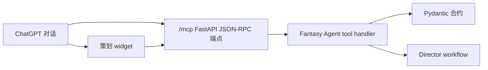

# 策划工作台

Fantasy Agent 可以作为 ChatGPT 内的交互式游戏生产工作台运行。ChatGPT 入口只承担计划与编排：它把 prompt 转成可检查的玩法、GDD、Unreal、Godot、Blender、ComfyUI 和 QA 交接结果，不直接执行外部生产工具。

## 架构



## 工具入口

第一版所有工具都是只读且幂等的。

- `extract_idea_seed`：计划生成前的访谈式创意挖掘。
- `generate_game_production_plan`：完整 prompt-to-playable 计划。
- `render_gdd`：Markdown GDD。
- `prepare_unreal_plan`：只生成 UE5 工程架构计划。
- `prepare_godot_plan`：只生成 Godot quick-play 架构计划。
- `prepare_blender_plan`：只生成程序化灰盒资产任务计划。
- `prepare_comfyui_plan`：只生成视觉参考任务计划。
- `prepare_qa_plan`：只生成可玩循环 QA 计划。

## 状态与输出

工具结果使用：

- `structuredContent`：模型可见的精简 JSON。
- `_meta`：widget 状态，例如完整计划和当前 panel。
- `content`：简短对话摘要。
- `ui://fantasy-agent/workbench.html`：widget resource URI。

在 ChatGPT 托管环境中，widget 读取 `window.openai.toolOutput`、`window.openai.toolResponseMetadata` 和 `window.openai.toolInput`。在本地浏览器预览中，它调用 `/debug/tool/{tool_name}`，方便不接入 ChatGPT 时测试 UI。

## i18n

ChatGPT widget 保持实现标识为英文，面向用户的标签支持简体中文。生成的 GDD 遵循 `PromptRequest.output_locales`。

## 安全规则

- 没有明确确认时，不得从 ChatGPT 执行 Unreal、Godot、Blender、ComfyUI 或 GitHub 副作用。
- ComfyUI 是视觉参考工人，不是玩法权威。
- 生成计划只是可检查交接，不等同于原型已经可玩。
- QA 必须先于视觉扩展或打包验证循环。

## 本地测试

```powershell
uvicorn app.main:app --reload --app-dir apps/chatgpt-workbench --host 127.0.0.1 --port 8787
```

打开：

```text
http://127.0.0.1:8787
```

在 ChatGPT Developer Mode 中使用时，需要通过 HTTPS 暴露同一服务，并连接以 `/mcp` 结尾的公开 URL。
