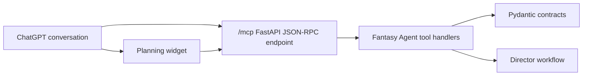

# Planning Workbench

Fantasy Agent can run inside ChatGPT as an interactive game production workbench. The ChatGPT surface is intentionally a planning and orchestration layer: it turns a prompt into inspectable gameplay, GDD, Unreal, Blender, ComfyUI, and QA handoffs without executing external production tools.

Fantasy Agent 可以作为 ChatGPT 内的交互式策划工作台运行。ChatGPT 入口只承担计划与编排：把 prompt 转成可检查的玩法、GDD、Unreal、Blender、ComfyUI 与 QA 交接结果，不直接执行外部生产工具。

## Architecture



## Tool Surface

All tools are read-only and idempotent in the first implementation.

所有工具在第一版中都是只读且幂等的。

- `extract_idea_seed`: interview-style creative discovery before plan generation.
- `generate_game_production_plan`: full prompt-to-playable plan.
- `render_gdd`: bilingual markdown GDD.
- `prepare_unreal_plan`: UE5 project architecture plan only.
- `prepare_blender_plan`: procedural greybox asset job plan only.
- `prepare_comfyui_plan`: visual reference job plan only.
- `prepare_qa_plan`: playable-loop QA plan only.

## State And Output

Tool results use:

- `structuredContent` for concise model-visible JSON.
- `_meta` for widget state such as the full plan and active panel.
- `content` for short conversational summaries.
- `ui://fantasy-agent/workbench.html` as the widget resource URI.

The widget reads `window.openai.toolOutput`, `window.openai.toolResponseMetadata`, and `window.openai.toolInput` when hosted in ChatGPT. In local browser preview, it calls `/debug/tool/{tool_name}` so the UI can be tested without ChatGPT.

## i18n

The ChatGPT widget keeps implementation identifiers in English and human-facing labels in English and Simplified Chinese. Generated GDD content follows `PromptRequest.output_locales`, defaulting to `["en", "zh-CN"]`.

ChatGPT widget 保持实现标识为英文，面向用户的标签支持英文与简体中文。生成的 GDD 遵循 `PromptRequest.output_locales`，默认输出 `["en", "zh-CN"]`。

## Safety Rules

- Do not execute Unreal, Blender, ComfyUI, or GitHub side effects from ChatGPT without explicit confirmation.
- Keep ComfyUI as a visual reference worker, not a gameplay authority.
- Treat generated plans as inspectable handoffs, not proof that a prototype is playable.
- QA must validate the loop before visual expansion or packaging.

## Local Testing

```powershell
uvicorn app.main:app --reload --app-dir apps/chatgpt-workbench --host 127.0.0.1 --port 8787
```

Then open:

```text
http://127.0.0.1:8787
```

For ChatGPT Developer Mode, expose the same server through HTTPS and connect the public URL ending in `/mcp`.
